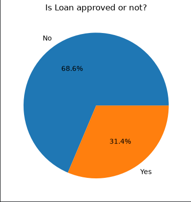
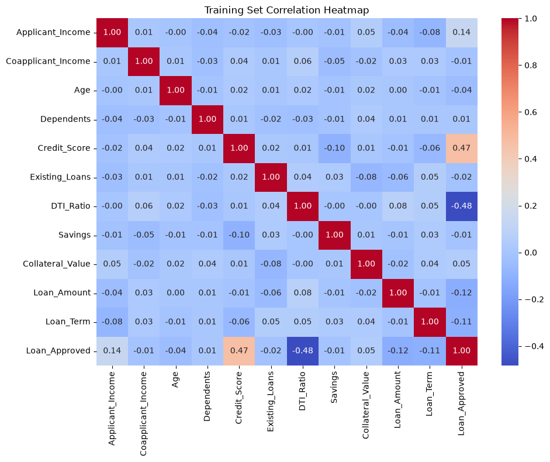
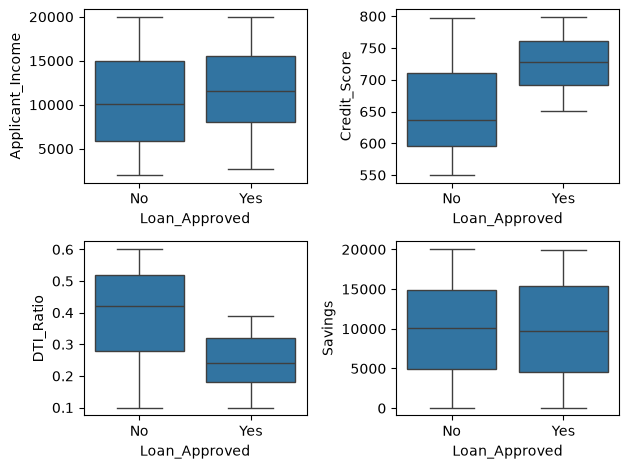
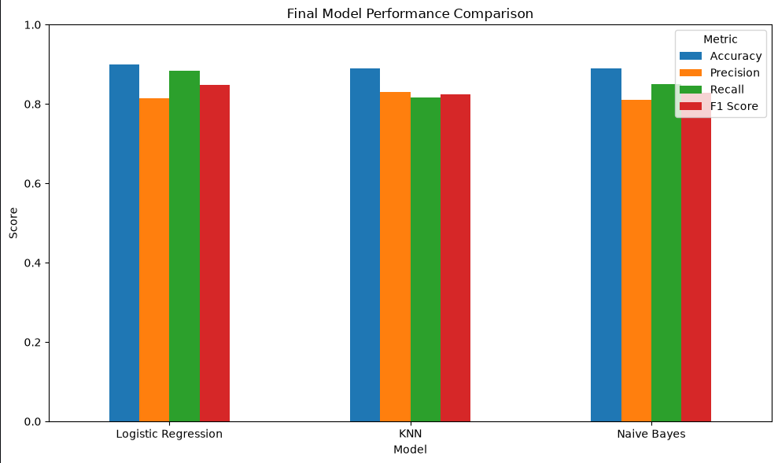
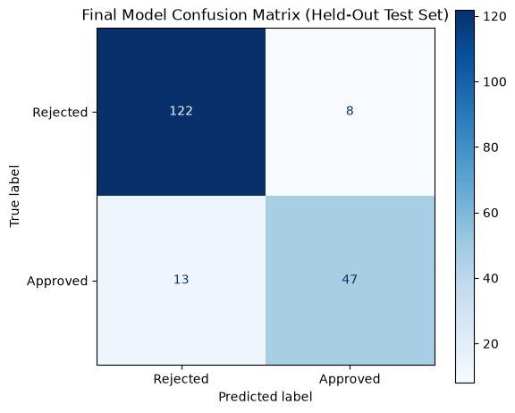
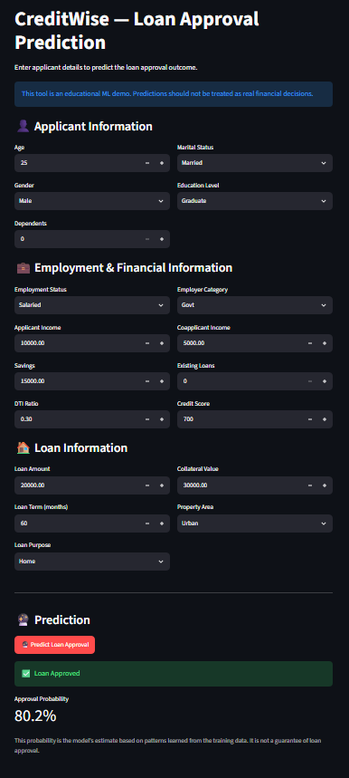
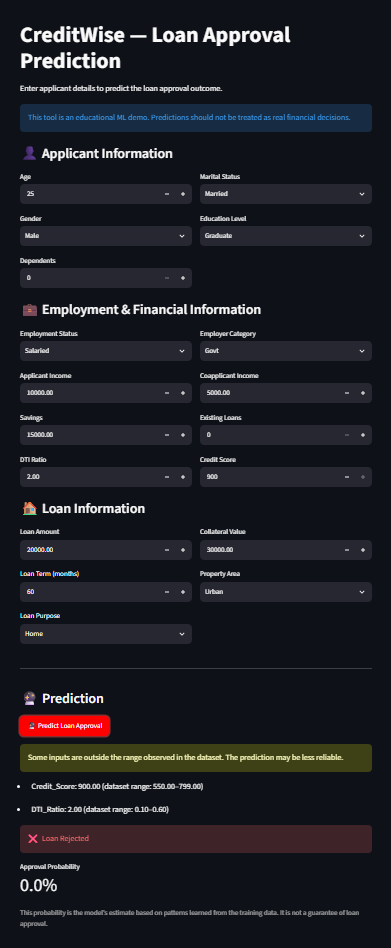
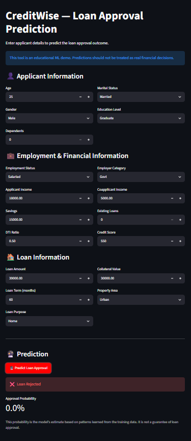

# CreditWise — Loan Approval Prediction

A Machine Learning classification project that predicts whether a loan application is **Approved** or **Rejected** using applicant, financial, employment, and credit-related information.

🔗 **[Live Demo](https://creditwise-loan-predict.streamlit.app/)**

---

## 📌 Overview

CreditWise is an end-to-end supervised Machine Learning classification project developed to predict loan approval outcomes from historical loan application data.

The project covers the complete workflow from data understanding and exploratory data analysis to preprocessing, feature engineering, model comparison, hyperparameter tuning, and final model selection.

Three classification algorithms were evaluated:

- **Logistic Regression**
- **K-Nearest Neighbors (KNN)**
- **Gaussian Naive Bayes**

The models were evaluated using:

- Accuracy
- Precision
- Recall
- F1 Score
- Confusion Matrix

---

## 🎯 Problem Statement

Loan applications are evaluated using factors such as income, employment status, credit score, existing loans, debt-to-income ratio, savings, collateral, and loan requirements.

The objective of CreditWise is to build a Machine Learning system that can predict whether a loan application is likely to be **Approved** or **Rejected** based on historical application data.

Because incorrect approval and rejection decisions can have financial consequences, multiple evaluation metrics are considered rather than relying only on accuracy.

---

## 📊 Dataset

The original dataset contains:

- **1,000 loan applications**
- **20 columns**

Rows with missing values in the target variable `Loan_Approved` were removed because supervised learning requires a known target label.

After removing rows with missing target values, **950 labeled records** were available for model development.

### Features

| Feature | Description |
|---|---|
| `Applicant_ID` | Unique applicant identifier |
| `Applicant_Income` | Applicant income |
| `Coapplicant_Income` | Coapplicant income |
| `Employment_Status` | Employment status |
| `Age` | Applicant age |
| `Marital_Status` | Marital status |
| `Dependents` | Number of dependents |
| `Credit_Score` | Applicant credit score |
| `Existing_Loans` | Number of existing loans |
| `DTI_Ratio` | Debt-to-Income ratio |
| `Savings` | Applicant savings |
| `Collateral_Value` | Value of collateral |
| `Loan_Amount` | Requested loan amount |
| `Loan_Term` | Loan duration |
| `Loan_Purpose` | Purpose of the loan |
| `Property_Area` | Property area |
| `Education_Level` | Applicant education level |
| `Gender` | Applicant gender |
| `Employer_Category` | Employer category |

`Applicant_ID` is treated as an identifier and is not used as a predictive feature.

### Target Variable

`Loan_Approved`

```text
0 → Rejected
1 → Approved
```

---

## 🔎 Exploratory Data Analysis

### Loan Approval Distribution



After removing records with missing target values, the labeled dataset contains:

- 650 Rejected applications
- 300 Approved applications

This corresponds to approximately:

- 68.42% Rejected
- 31.58% Approved

The target distribution was considered when interpreting model performance.

### Correlation Analysis



Correlation analysis was performed on numerical features together with the target variable to understand relationships between the numerical variables and loan approval.

Among the numerical features, Credit Score showed the strongest positive relationship with loan approval, while DTI Ratio showed the strongest negative relationship.

### Feature Distributions



The distributions of the numerical variables were inspected to understand their spread, scale, and general behavior before model development.

---

## 🔄 Machine Learning Workflow

```text
Data Loading
     ↓
Raw Data Inspection
     ↓
Initial Exploratory Data Analysis
     ↓
Remove Rows with Missing Target
     ↓
Separate Features and Target
     ↓
Correlation Analysis
     ↓
Train-Test Split
     ↓
Feature Type Detection
     ↓
Data Preprocessing
     ├── Numerical Imputation
     ├── Numerical Scaling
     ├── Education-Level Ordinal Encoding
     └── Other Categorical One-Hot Encoding
     ↓
Baseline Model Training
     ├── Logistic Regression
     ├── KNN
     └── Gaussian Naive Bayes
     ↓
Model Evaluation
     ↓
Feature Engineering
     ├── DTI_Ratio²
     └── Credit_Score²
     ↓
Retraining & Re-evaluation
     ↓
Hyperparameter Tuning
     ↓
Final Model Comparison
     ↓
Best Model Selection
```

---

## ⚙️ Data Preprocessing

Different preprocessing techniques were applied according to feature type.

### Numerical Features

Missing numerical values were handled using mean imputation, followed by standardization using `StandardScaler`.

```text
Numerical Features
       ↓
SimpleImputer(strategy="mean")
       ↓
StandardScaler
```

Scaling is especially important for distance-based algorithms such as KNN and also ensures that numerical features are placed on comparable scales.

### Categorical Features

Categorical features were divided into:

- Ordinal categorical features
- Nominal categorical features

#### Education Level

The actual `Education_Level` categories in the dataset are:

- Not Graduate
- Graduate

Because these categories have a natural ordering in the context of education level, `OrdinalEncoder` was used:

```text
Not Graduate → 0
Graduate     → 1
```

#### Other Categorical Features

The remaining categorical variables were treated as nominal features and encoded using `OneHotEncoder`.

```text
Categorical Features
       ↓
SimpleImputer(strategy="most_frequent")
       ↓
OneHotEncoder
```

The categorical encoder uses:

- `drop="first"`
- `handle_unknown="ignore"`

`drop="first"` reduces redundant dummy variables, while `handle_unknown="ignore"` allows unseen categories in transformed data to be handled safely.

### Target Encoding

The target variable was explicitly encoded as:

```text
No  → 0
Yes → 1
```

The target is handled separately from feature preprocessing and is not passed through the feature `ColumnTransformer`.

---

## 🤖 Models Evaluated

### 1. Logistic Regression

Logistic Regression was used as a linear classification algorithm to predict loan approval outcomes.

It provides a strong and interpretable baseline for binary classification problems.

### 2. K-Nearest Neighbors (KNN)

KNN classifies an observation based on the classes of nearby training observations.

Because KNN relies on distances between observations, feature scaling is particularly important.

### 3. Gaussian Naive Bayes

Gaussian Naive Bayes is a probabilistic classification algorithm based on Bayes' theorem and assumes Gaussian distributions for numerical features.

---

## 📏 Evaluation Metrics

The following metrics were used to evaluate every model:

- Accuracy
- Precision
- Recall
- F1 Score
- Confusion Matrix

### Why Multiple Metrics?

Accuracy measures the overall percentage of correct predictions, but it does not describe the types of mistakes being made.

For this project:

- Precision is useful when we want to understand how reliable predicted approvals are.
- Recall measures how many actual approved applications are correctly identified.
- F1 Score provides a balance between Precision and Recall.

With:

```text
0 → Rejected
1 → Approved
```

a false positive means:

```text
Actual:    Rejected
Predicted: Approved
```

Therefore, precision for the Approved class helps measure how frequently approval predictions are actually correct.

For the final model comparison, the complete set of metrics was considered, with F1 Score providing an important measure of the Precision-Recall balance.

---

## 🧪 Baseline Model Results

Before feature engineering and hyperparameter tuning, the models achieved the following test-set results:

| Model | Accuracy | Precision | Recall | F1 Score |
|---|---:|---:|---:|---:|
| Logistic Regression | 90.00% | 85.96% | 81.67% | 83.76% |
| KNN | 86.84% | 78.69% | 80.00% | 79.34% |
| Gaussian Naive Bayes | 88.95% | 80.95% | 85.00% | 82.93% |

### Baseline Observation

Logistic Regression achieved the highest baseline Accuracy, Precision, and F1 Score.

Gaussian Naive Bayes achieved the highest baseline Recall.

---

## 🧬 Feature Engineering

Two nonlinear features were introduced:

- `DTI_Ratio²`
- `Credit_Score²`

They were created by squaring the original `DTI_Ratio` and `Credit_Score` features.

```python
X_train["DTI_Ratio_sq"] = X_train["DTI_Ratio"] ** 2
X_test["DTI_Ratio_sq"] = X_test["DTI_Ratio"] ** 2

X_train["Credit_Score_sq"] = X_train["Credit_Score"] ** 2
X_test["Credit_Score_sq"] = X_test["Credit_Score"] ** 2
```

The original features were retained alongside the engineered features.

### Why These Features?

The purpose was to test whether nonlinear transformations of:

- Debt-to-Income Ratio
- Credit Score

could provide additional predictive information to the models.

### Feature Engineering Results

After adding the engineered features, all three models produced the same test-set predictions and metrics as the baseline models.

| Model | Baseline Accuracy | FE Accuracy | Baseline F1 | FE F1 |
|---|---:|---:|---:|---:|
| Logistic Regression | 90.00% | 90.00% | 83.76% | 83.76% |
| KNN | 86.84% | 86.84% | 79.34% | 79.34% |
| Gaussian Naive Bayes | 88.95% | 88.95% | 82.93% | 82.93% |

### Feature Engineering Observation

The engineered features were successfully incorporated into the preprocessing and model pipelines, but they did not improve the test-set performance on this dataset.

This is a valid Machine Learning outcome. Feature engineering does not guarantee an improvement in model performance for every dataset.

---

## 🔧 Hyperparameter Tuning

After feature engineering, hyperparameter tuning was performed using `GridSearchCV` with 5-fold cross-validation.

The tuning objective was:

```text
scoring="accuracy"
```

This means the hyperparameters were optimized based on cross-validation Accuracy.

Final model selection, however, considered the complete set of test-set metrics.

### Logistic Regression

The following values of `C` were evaluated:

```text
C = [0.01, 0.1, 1, 10, 100]
```

Best Parameter: `C = 100`

Best Cross-Validation Accuracy: **90.39%**

### KNN

The number of neighbors was tuned using multiple candidate values.

Best Parameter: `n_neighbors = 11`

Best Cross-Validation Accuracy: **88.03%**

### Gaussian Naive Bayes

The variance smoothing parameter was tuned.

Best Parameter: `var_smoothing = 1e-11`

Best Cross-Validation Accuracy: **88.95%**

### Best Hyperparameters Summary

| Model | Best Hyperparameter | Best CV Accuracy |
|---|---|---:|
| Logistic Regression | C = 100 | 90.39% |
| KNN | n_neighbors = 11 | 88.03% |
| Gaussian Naive Bayes | var_smoothing = 1e-11 | 88.95% |

---

## 📊 Final Model Comparison



The following results were obtained on the held-out test set after feature engineering and hyperparameter tuning:

| Model | Accuracy | Precision | Recall | F1 Score |
|---|---:|---:|---:|---:|
| **Logistic Regression** | **90.00%** | 81.54% | **88.33%** | **84.80%** |
| KNN | 88.95% | **83.05%** | 81.67% | 82.35% |
| Gaussian Naive Bayes | 88.95% | 80.95% | 85.00% | 82.93% |

### Final Observations

- Logistic Regression achieved the highest Accuracy.
- Logistic Regression achieved the highest Recall.
- Logistic Regression achieved the highest F1 Score.
- KNN achieved the highest Precision.
- Gaussian Naive Bayes achieved 85.00% Recall.
- Logistic Regression provided the strongest overall balance across the evaluated metrics.

---

## 🏆 Best Model Selection

### Logistic Regression

Logistic Regression was selected as the final model after hyperparameter tuning.

### Final Performance

| Metric | Score |
|---|---:|
| Accuracy | **90.00%** |
| Precision | 81.54% |
| Recall | **88.33%** |
| F1 Score | **84.80%** |

Logistic Regression achieved the highest:

- Accuracy
- Recall
- F1 Score

KNN achieved the highest Precision at 83.05%.

Therefore, Logistic Regression was selected because it provided the strongest overall performance while maintaining the best balance between Precision and Recall.

---

## 🧮 Final Confusion Matrix



The final Logistic Regression model produced the following confusion matrix:

```text
                 Predicted
                Rejected  Approved

Actual Rejected    118       12
Actual Approved      7       53
```

This corresponds to:

- True Negatives: 118
- False Positives: 12
- False Negatives: 7
- True Positives: 53

### Interpretation

- 118 rejected applications were correctly predicted as rejected.
- 12 rejected applications were incorrectly predicted as approved.
- 7 approved applications were incorrectly predicted as rejected.
- 53 approved applications were correctly predicted as approved.

---

## 💡 Key Takeaways

- Different feature types require different preprocessing strategies.
- Missing target values should be removed because their true class is unknown.
- A `ColumnTransformer` provides a clean way to apply different preprocessing operations to numerical and categorical features.
- `Education_Level` was treated separately using ordinal encoding because the dataset contains the two categories Not Graduate and Graduate.
- The remaining categorical variables were handled using one-hot encoding.
- Feature scaling is particularly important for distance-based algorithms such as KNN.
- Feature engineering using `DTI_Ratio²` and `Credit_Score²` did not improve the test-set predictions for this dataset.
- Hyperparameter tuning improved the final Logistic Regression balance between Precision and Recall.
- Logistic Regression achieved the highest final Accuracy, Recall, and F1 Score.
- KNN achieved the highest final Precision.
- Model selection should consider the business consequences of different types of classification errors rather than relying on a single metric.

---

## 🛠️ Technologies Used

- Python
- Pandas
- NumPy
- Matplotlib
- Seaborn
- Scikit-learn
- Jupyter Notebook

---

## 📁 Project Structure

```text
CreditWise-Loan-Approval/
│
├── images/
│   ├── confusion_matrix.png
│   ├── correlation_heatmap.png
│   ├── feature_distributions.png
│   ├── model_comparison.png
│   └── target_distribution.png
│
├── credit_wise.ipynb
├── app.py
├── model.pkl
├── README.md
├── requirements.txt
└── .gitignore
```

---

## ⚠️ Disclaimer

This project is developed for educational and portfolio purposes only.

The model is not intended to be used as a real-world automated financial decision-making system.

A production loan approval system would require substantially more data, external validation, fairness and bias assessment, threshold analysis, domain expertise, regulatory review, continuous monitoring, and appropriate human oversight.

The reported performance reflects the specific dataset and test split used in this project and should not be interpreted as real-world financial decision-making accuracy.

## 🖥️ Streamlit Demo

🔗 **[Live Demo](https://creditwise-loan-predict.streamlit.app/)**

CreditWise includes a Streamlit web application that allows users to enter applicant, employment, financial, and loan information and receive a loan approval prediction from the trained Logistic Regression pipeline.

The application includes:

- Interactive input fields
- Input validation
- Dataset-range warnings for unusual values
- Feature engineering
- Loan approval prediction
- Approval probability display

### 📸 Application Screenshots

#### Normal Prediction


#### Out-of-Distribution Input Warning


#### Loan Rejected Prediction


### Running the Application

Install the required dependencies:

```bash
pip install -r requirements.txt
```

Run the Streamlit application:

```bash
streamlit run app.py
```

The application will open in the browser and provide an interactive interface for making predictions.

**Note:** The application is intended for educational and portfolio demonstration purposes. Predictions should not be treated as actual financial decisions.